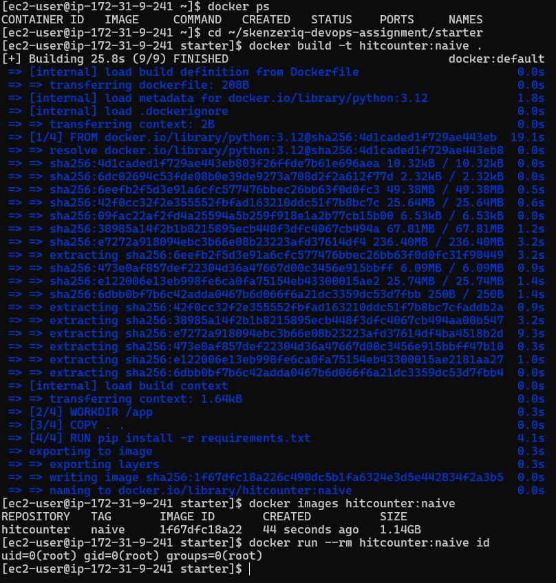
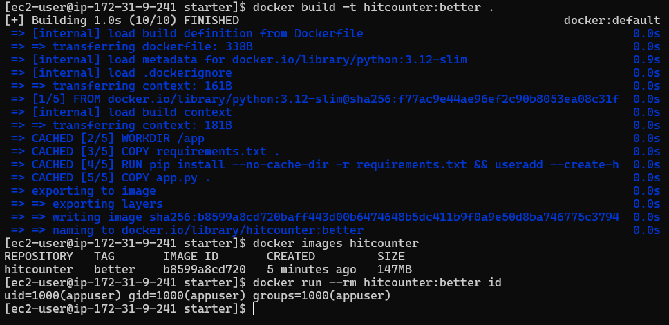
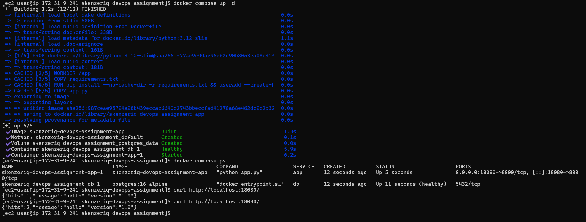
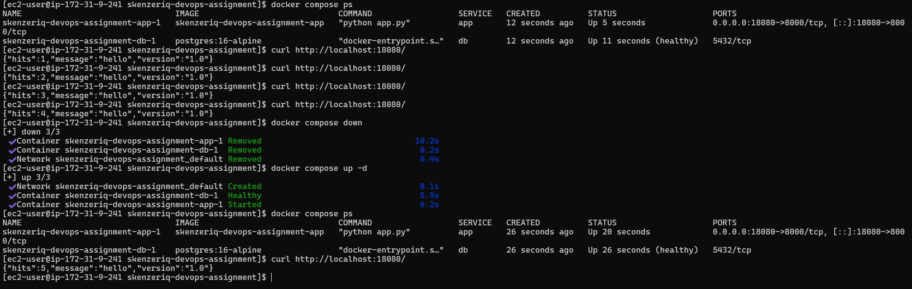
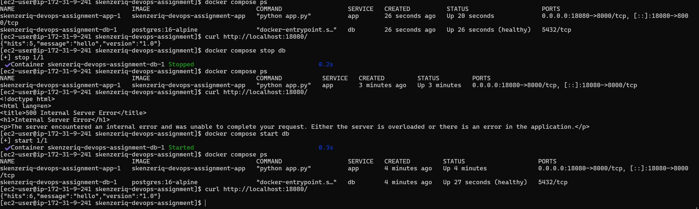

# SkenzerIQ DevOps Assignment

> **Deployment and Infrastructure Intern — Technical Assignment**

A containerized Python hit-counter application backed by PostgreSQL, implemented using Docker and Docker Compose.

This submission covers:

- Docker image optimization
- Non-root container execution
- Docker Compose orchestration
- PostgreSQL health checks
- Persistent database storage
- Environment-based configuration
- Database failure and recovery testing
- PostgreSQL backup and restore

---

## 1. Project Overview

The supplied application is a small Flask-based hit counter backed by PostgreSQL.

### Application Endpoints

**`GET /`**

Inserts a new hit into PostgreSQL and returns the current hit count.

**`GET /healthz`**

Checks whether the application can reach PostgreSQL.

The supplied `app.py` was kept unchanged as required by the assignment.

The infrastructure and container configuration were implemented around the supplied application.

---

## 2. Architecture

```text
                         HTTP
                          |
                          v
                 +-----------------+
                 |      Host       |
                 |   Port :18080   |
                 +--------+--------+
                          |
                          v
                 +-----------------+
                 |      app        |
                 |  Flask / Python |
                 |  Container:8000 |
                 |                 |
                 |  non-root user  |
                 |     appuser     |
                 +--------+--------+
                          |
                       db:5432
                          |
                          v
                 +-----------------+
                 |       db        |
                 | PostgreSQL 16   |
                 |     Alpine      |
                 +--------+--------+
                          |
                          v
                 +-----------------+
                 |  postgres_data  |
                 |   Named Volume  |
                 +-----------------+
```

### Request Flow

```text
Client
  |
  | http://localhost:18080/
  v
app container
  |
  | PostgreSQL connection
  | db:5432
  v
PostgreSQL container
  |
  v
postgres_data
```

PostgreSQL is not published to the host. The application communicates with the database through the Docker Compose network.

---

## 3. Repository Structure

```text
.
├── README.md
├── docker-compose.yml
├── .env.example
├── .gitignore
├── hitcounter_backup.sql
├── screenshots/
│   ├── S1.png
│   ├── S2.png
│   ├── S3.png
│   ├── S4.png
│   └── S5.png
└── starter/
    ├── Dockerfile
    ├── .dockerignore
    ├── requirements.txt
    └── app.py
```

### Configuration

`.env` contains the local PostgreSQL credentials and is excluded from version control through `.gitignore`.

`.env.example` provides the configuration template without exposing the actual password.

---

## 4. Environment

The assignment was implemented and tested on:

| Component | Version |
|---|---|
| Operating System | Amazon Linux 2023 |
| Architecture | x86_64 |
| Docker Engine | 25.0.16 |
| Docker CLI | 25.0.14 |
| Docker Buildx | 0.37.1 |

The complete setup was tested on a single EC2 instance.

No application code was modified during the implementation.

---

## 5. Docker Image Improvements

The supplied Dockerfile was used as the baseline and then improved without changing the application code.

### 5.1 Baseline Image

The original image was built using:

```dockerfile
FROM python:3.12
WORKDIR /app
COPY . .
RUN pip install -r requirements.txt
EXPOSE 8000
CMD ["python", "app.py"]
```

The baseline image was built as:

```bash
docker build -t hitcounter:naive .
```

The resulting image size was:

```text
1.14 GB
```

The container was also running as:

```text
uid=0(root) gid=0(root) groups=0(root)
```

These results established the baseline for the image improvements.

### S1 — Baseline Evidence



---

### 5.2 Improvements Implemented

The Dockerfile was changed to address the three main issues identified in the starter image.

#### Smaller Base Image

The full Python image was replaced with:

```dockerfile
FROM python:3.12-slim
```

This significantly reduced the image size.

#### Dependency Layering

The dependency file is copied and installed before the application source:

```dockerfile
COPY requirements.txt .

RUN pip install --no-cache-dir -r requirements.txt
```

The application code is copied afterwards:

```dockerfile
COPY app.py .
```

This keeps dependency installation in a separate Docker layer and allows the dependency layer to be reused when only application code changes.

#### Non-Root Execution

A dedicated application user was created:

```dockerfile
RUN pip install --no-cache-dir -r requirements.txt \
    && useradd --create-home --shell /usr/sbin/nologin appuser
```

The container then runs as:

```dockerfile
USER appuser
```

This prevents the application process from running as root.

---

### 5.3 Final Dockerfile

```dockerfile
FROM python:3.12-slim

WORKDIR /app

COPY requirements.txt .

RUN pip install --no-cache-dir -r requirements.txt \
    && useradd --create-home --shell /usr/sbin/nologin appuser

COPY app.py .

USER appuser

EXPOSE 8000

CMD ["python", "app.py"]
```

### 5.4 `.dockerignore`

A `.dockerignore` file was added to keep unnecessary files and local configuration out of the Docker build context.

```text
__pycache__
*.pyc
*.pyo
*.pyd
.git
.gitignore
.env
.venv
venv
```

The actual `.env` file is therefore excluded from the image build context.

---

### 5.5 Image Comparison

| Metric | Baseline | Improved |
|---|---:|---:|
| Base image | `python:3.12` | `python:3.12-slim` |
| Image size | **1.14 GB** | **147 MB** |
| Container user | `root` | `appuser` |
| Dependency caching | Limited | Improved |
| `.dockerignore` | Not present | Added |

The improved image was verified with:

```bash
docker run --rm hitcounter:better id
```

Result:

```text
uid=1000(appuser) gid=1000(appuser) groups=1000(appuser)
```

### S2 — Improved Image Evidence



---

### 5.6 Result

The image was reduced from **1.14 GB to 147 MB**, while the application was changed from running as `root` to running as the dedicated `appuser`.

The application source itself remained unchanged.

---

## 6. Docker Compose Deployment

The application and PostgreSQL database were deployed together using Docker Compose.

The Compose configuration contains two services:

- `app`
- `db`

The PostgreSQL service uses the required `postgres:16-alpine` image.

### 6.1 Compose Configuration

```yaml
services:

  app:
    build: ./starter
    ports:
      - "18080:8000"
    environment:
      DATABASE_URL: postgresql://hitcounter:${POSTGRES_PASSWORD}@db:5432/${POSTGRES_DB}
      APP_VERSION: "1.0"
    depends_on:
      db:
        condition: service_healthy
    restart: unless-stopped

  db:
    image: postgres:16-alpine
    environment:
      POSTGRES_DB: ${POSTGRES_DB}
      POSTGRES_USER: ${POSTGRES_USER}
      POSTGRES_PASSWORD: ${POSTGRES_PASSWORD}
    volumes:
      - postgres_data:/var/lib/postgresql/data
    healthcheck:
      test: ["CMD-SHELL", "pg_isready -U ${POSTGRES_USER} -d ${POSTGRES_DB}"]
      interval: 5s
      timeout: 5s
      retries: 10
    restart: unless-stopped

volumes:
  postgres_data:
```

### 6.2 Application Service

The application is built from the supplied `starter` directory.

The container listens on port `8000` and is exposed on the host at:

```text
http://localhost:18080
```

The application connects to PostgreSQL using the Compose service name:

```text
db:5432
```

No database IP address is hard-coded.

---

### 6.3 Database Service

PostgreSQL runs using:

```text
postgres:16-alpine
```

The database does not have a host port mapping.

The application reaches PostgreSQL internally through the Compose network, while PostgreSQL remains inaccessible directly through a host-published port.

---

### 6.4 Database Healthcheck

The database healthcheck uses:

```bash
pg_isready -U ${POSTGRES_USER} -d ${POSTGRES_DB}
```

The application uses:

```yaml
depends_on:
  db:
    condition: service_healthy
```

This makes the application wait for PostgreSQL to become healthy before starting.

---

### 6.5 Restart Policy

Both services use:

```yaml
restart: unless-stopped
```

This allows Docker to restart the containers automatically if they stop unexpectedly, while still allowing an intentional manual stop.

---

### 6.6 Persistent Database Storage

PostgreSQL uses the named volume:

```text
postgres_data
```

The volume is mounted at:

```text
/var/lib/postgresql/data
```

This keeps PostgreSQL data outside the database container lifecycle.

---

## 7. Initial Deployment Verification

The Compose stack was started using:

```bash
docker compose up -d
```

The services were then checked using:

```bash
docker compose ps
```

The resulting state showed:

```text
app    Up
db     Up (healthy)
```

The application was successfully reachable through:

```bash
curl http://localhost:18080/
```

and returned the expected JSON response.

### S3 — Compose Health and Application Verification



The S3 evidence shows both Compose services running, PostgreSQL in a healthy state, and a successful application request.

---

## 8. Data Persistence Verification

The named PostgreSQL volume was tested by creating application hits, removing the Compose containers, and starting the stack again.

Before recreating the stack, the hit count reached:

```text
4
```

The stack was then stopped and removed with:

```bash
docker compose down
```

The named volume was intentionally preserved.

The stack was started again with:

```bash
docker compose up -d
```

After the restart, another request returned:

```text
5
```

The count continued from `4` to `5` instead of starting again from `1`.

This verified that the PostgreSQL data survived container recreation through the named volume.

### S4 — Persistence Verification



The S4 evidence demonstrates that the hit-counter data remained available after `docker compose down` followed by `docker compose up -d`.

> **Important:** `docker compose down -v` was not used during this test because removing the named volume would also remove the stored PostgreSQL data.

---

## 9. Database Failure and Recovery

A database failure scenario was intentionally tested without restarting the application container.

The PostgreSQL service was stopped using:

```bash
docker compose stop db
```

The application container remained running.

A request to the application endpoint was then made:

```bash
curl http://localhost:18080/
```

The application returned:

```text
500 Internal Server Error
```

This confirmed that the application could not complete a database-dependent request while PostgreSQL was unavailable.

### Recovery

Only the database service was started again:

```bash
docker compose start db
```

The database returned to a healthy state:

```text
db    Up    (healthy)
```

The application container was not restarted.

A new request was then made:

```bash
curl http://localhost:18080/
```

The application successfully recovered and returned:

```json
{"hits":6,"message":"hello","version":"1.0"}
```

This verified that the running application could successfully reconnect to PostgreSQL after the database service became available again.

### S5 — Database Failure and Recovery



The S5 evidence shows the failure while PostgreSQL was stopped and the successful application response after PostgreSQL was started again.

---

## 10. Database Backup and Restore

A PostgreSQL backup and restore test was performed using `pg_dump` inside the running database container.

### 10.1 Create Backup

The database was backed up using:

```bash
docker compose exec -T db pg_dump -U hitcounter -d hitcounter > hitcounter_backup.sql
```

The resulting backup file was created on the host:

```text
hitcounter_backup.sql
```

The backup file size was approximately:

```text
2.1K
```

---

### 10.2 Create Separate Restore Database

A separate database was created so the original `hitcounter` database was not overwritten:

```bash
docker compose exec db psql -U hitcounter -d hitcounter -c "CREATE DATABASE hitcounter_restore;"
```

---

### 10.3 Restore Backup

The backup was restored into the new database:

```bash
cat hitcounter_backup.sql | docker compose exec -T db psql -U hitcounter -d hitcounter_restore
```

The restore completed successfully and restored the `hits` table data.

---

### 10.4 Row Count Verification

The original database was checked with:

```bash
docker compose exec db psql -U hitcounter -d hitcounter -c "SELECT count(*) FROM hits;"
```

Result:

```text
6
```

The restored database was checked with:

```bash
docker compose exec db psql -U hitcounter -d hitcounter_restore -c "SELECT count(*) FROM hits;"
```

Result:

```text
6
```

### Backup/Restore Result

| Database | Rows in `hits` |
|---|---:|
| Original `hitcounter` | **6** |
| Restored `hitcounter_restore` | **6** |

The matching row counts verify that the application data was successfully backed up and restored into a separate PostgreSQL database.

---

## 11. Security and Configuration

### Database Credentials

The PostgreSQL password is supplied through `.env` rather than being committed directly to the Compose configuration.

The repository contains:

```text
.env.example
```

as a configuration template.

The actual `.env` file is excluded using:

```text
.env
```

in `.gitignore`.

### Database Exposure

PostgreSQL has no host `ports` mapping in the Compose configuration.

The database is therefore reachable by the application through:

```text
db:5432
```

inside the Compose network, without exposing PostgreSQL directly on the EC2 host.

### Container Privileges

The application container runs as:

```text
appuser
```

rather than `root`.

This was verified with:

```bash
docker run --rm hitcounter:better id
```

Result:

```text
uid=1000(appuser) gid=1000(appuser) groups=1000(appuser)
```

---

## 12. What I Did Not Test

The assignment was implemented and tested on a single Amazon Linux 2023 EC2 instance.

The following were not tested:

- Production cloud deployment
- High-availability PostgreSQL
- PostgreSQL replication
- Application load testing
- Kubernetes deployment
- HTTPS/TLS termination
- Automated CI/CD
- Production monitoring and alerting
- Scheduled automated database backups
- Multi-host deployment

The tests performed were limited to the Docker, Docker Compose, PostgreSQL persistence, failure/recovery, and backup/restore requirements of this assignment.

---

## 13. How to Run

### Prerequisites

The environment requires:

- Docker
- Docker Compose

### 1. Clone or copy the project

Move into the project directory:

```bash
cd skenzeriq-devops-assignment
```

### 2. Configure environment variables

Create `.env` using `.env.example` as a reference.

Example:

```env
POSTGRES_DB=hitcounter
POSTGRES_USER=hitcounter
POSTGRES_PASSWORD=<your-password>
```

The `.env` file is intentionally excluded from version control.

### 3. Start the application

```bash
docker compose up -d
```

### 4. Check service status

```bash
docker compose ps
```

The expected state is:

```text
app    Up
db     Up (healthy)
```

### 5. Test the application

```bash
curl http://localhost:18080/
```

Example response:

```json
{
  "hits": 1,
  "message": "hello",
  "version": "1.0"
}
```

The hit count will increase with each request.

---

## 14. How to Stop

To stop and remove the application and database containers:

```bash
docker compose down
```

The named PostgreSQL volume is preserved.

To intentionally remove the containers, network, and database volume:

```bash
docker compose down -v
```

`docker compose down -v` should only be used when deleting the stored PostgreSQL data is intentional.

---

## 15. Evidence

The required screenshots are included in the `screenshots/` directory.

| Screenshot | Evidence |
|---|---|
| **S1** | Baseline `hitcounter:naive` image size and root user |
| **S2** | Improved image size and non-root `appuser` |
| **S3** | Compose services running, PostgreSQL healthy, application responding |
| **S4** | Hit-counter data surviving Compose restart |
| **S5** | Database failure followed by successful recovery |

### Evidence Files

```text
screenshots/
├── S1.png
├── S2.png
├── S3.png
├── S4.png
└── S5.png
```

---

## 16. Implementation Results

| Area | Result |
|---|---|
| Baseline image | `1.14 GB` |
| Improved image | `147 MB` |
| Application user | `appuser` |
| Database image | `postgres:16-alpine` |
| Application host port | `18080` |
| Database host port | Not published |
| Database healthcheck | `pg_isready` |
| Database storage | Named volume `postgres_data` |
| Persistence test | `hits: 4 → 5` |
| Failure test | `500 Internal Server Error` when DB stopped |
| Recovery test | Application recovered after DB restart |
| Backup file | `hitcounter_backup.sql` |
| Backup size | `2.1K` |
| Original row count | `6` |
| Restored row count | `6` |

---

## 17. Assignment Completion

The implementation covers the requested areas:

- [x] Starter application kept unchanged
- [x] Baseline Docker image built
- [x] Docker image optimized using a slim Python base
- [x] Application runs as a non-root user
- [x] Dependencies installed before application source
- [x] `.dockerignore` added
- [x] Docker Compose configuration created
- [x] `app` and `db` services configured
- [x] PostgreSQL healthcheck implemented
- [x] Application waits for healthy database
- [x] Automatic restart policy configured
- [x] PostgreSQL named volume configured
- [x] PostgreSQL not published to host
- [x] `.env` used for database credentials
- [x] `.env.example` provided
- [x] Database persistence tested
- [x] Database failure tested
- [x] Database recovery tested
- [x] PostgreSQL backup created
- [x] Backup restored into a separate database
- [x] Original and restored row counts verified
- [x] S1–S5 evidence captured

---

## 18. Final Notes

This implementation was intentionally kept small and focused on the requirements of the assignment.

The application code was not modified. The work was performed around the supplied application through Docker image improvements, Compose configuration, persistence, failure testing, and database backup/restore.

All functional tests documented in this README were executed on the EC2-based lab environment used for the assignment.
